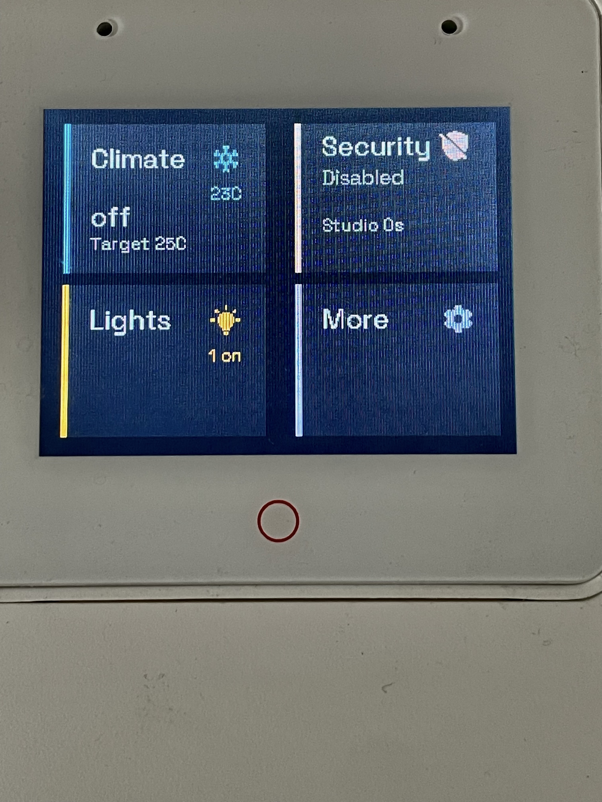
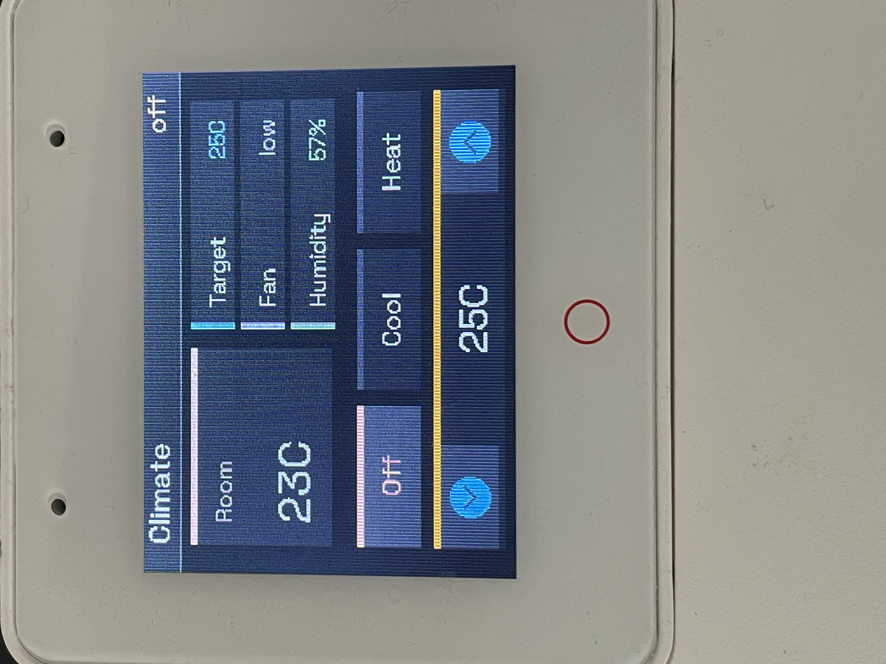
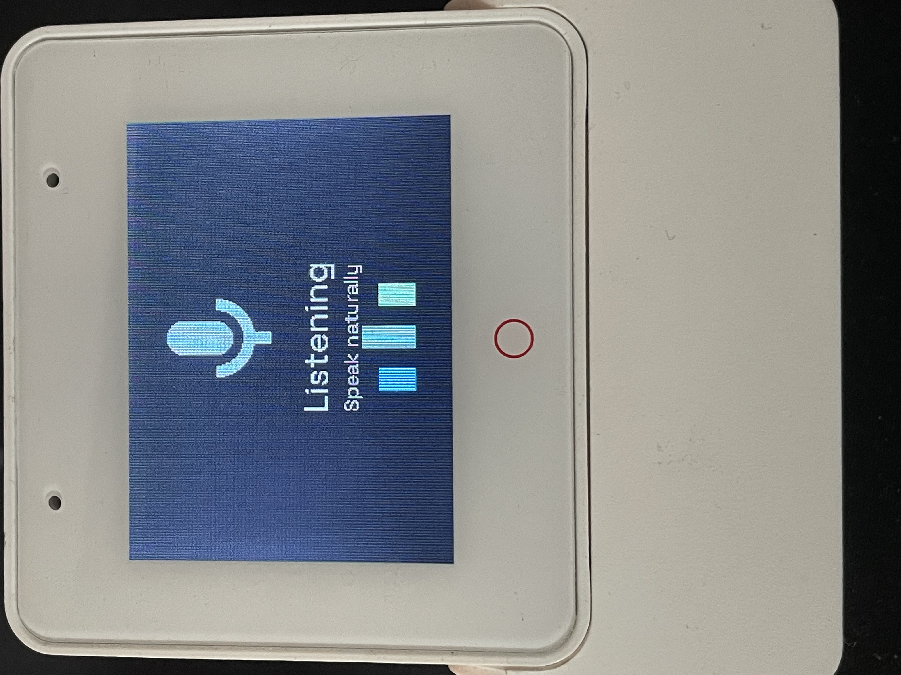
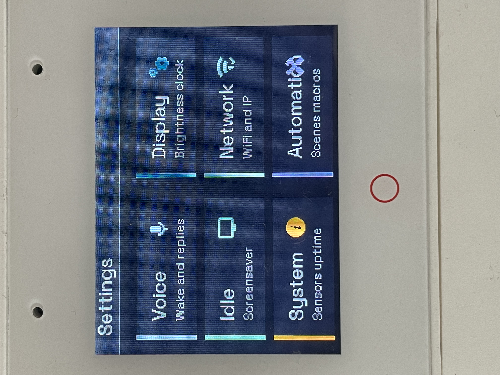
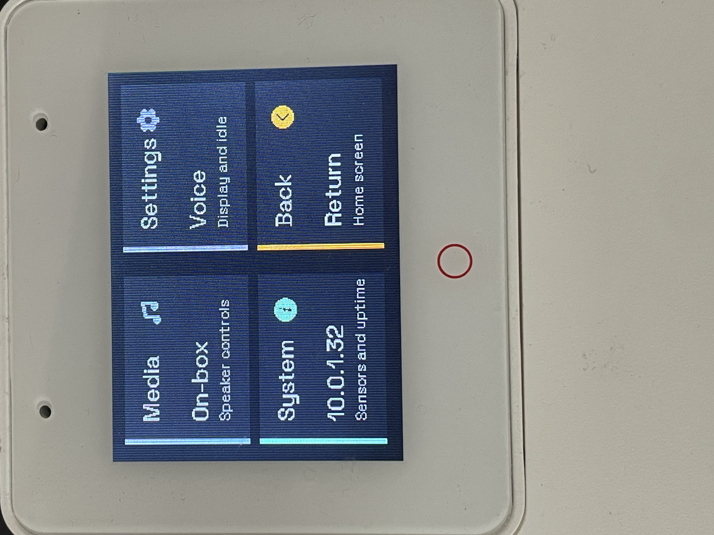
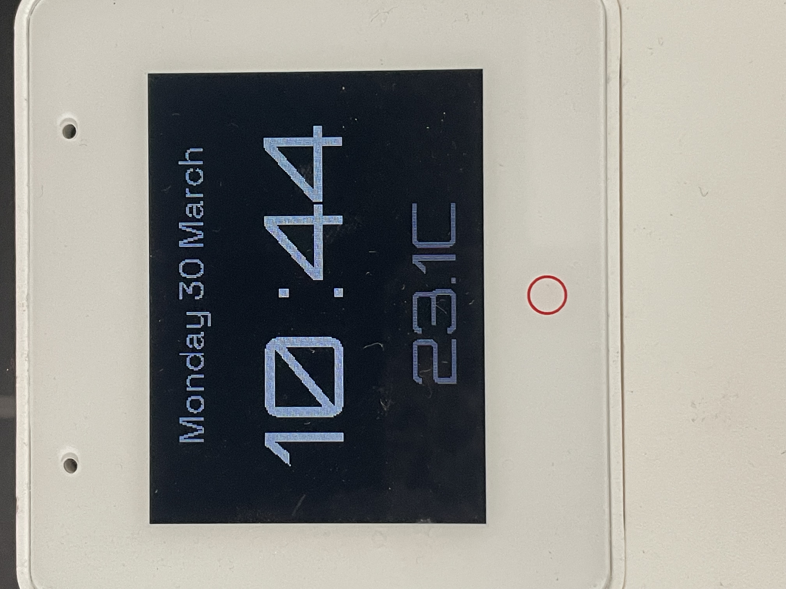

# ESP32-S3-Box-3 Assistant

GitHub-friendly ESPHome configuration for the ESP32-S3-Box-3 with:

- voice assistant support
- on-device and cloud wake-word modes
- touchscreen dashboard controls
- Home Assistant media, climate, alarm, light, scene, and script integration

## Screenshots

| Home | Climate |
| --- | --- |
|  |  |

| Voice | Settings |
| --- | --- |
|  |  |

| Media and system | Idle clock |
| --- | --- |
|  |  |

## Files

- `esp32-s3box-3-assistant-gh.yaml`: main ESPHome config template
- `INSTRUCTIONS.md`: secondary reference notes
- `IMG_4535.jpeg` to `IMG_4544.jpeg`: example device screenshots used in this README

## What This Template Changes

- personal entity IDs were replaced with placeholders
- `home_assistant_host` uses a real network-style example instead of `localhost`
- the wake-path selector keeps the last chosen mode and defaults first-time setup to `Edge wake`

## Requirements

- ESP32-S3-Box-3
- ESPHome with voice assistant support
- Home Assistant
- a working `secrets.yaml` for Wi-Fi credentials

## Quick Start

1. Copy `esp32-s3box-3-assistant-gh.yaml` into your ESPHome config directory.
2. Add Wi-Fi secrets to `secrets.yaml`.
3. Edit the substitutions at the top of the YAML file.
4. Validate the config with `esphome config`.
5. Compile and flash it.

## Required Secrets

Add these to your ESPHome `secrets.yaml`:

```yaml
wifi_ssid: "Your Wi-Fi SSID"
wifi_password: "Your Wi-Fi password"
```

## Required Substitutions

Edit these values before first flash.

### Device identity

- `name`: device hostname used by ESPHome and mDNS
- `friendly_name`: display name shown in Home Assistant

### Core Home Assistant entities

- `external_media_player`: media player object ID only, for example `living_room_speaker`
- `climate_entity`: full climate entity ID, for example `climate.living_room_ac`
- `alarm_entity`: full alarm entity ID, for example `alarm_control_panel.home_alarm`
- `room_temperature_entity`: full sensor entity ID
- `last_motion_entity`: full sensor entity ID
- `home_assistant_host`: Home Assistant base URL reachable by other devices on your network

Do not include the `media_player.` prefix in `external_media_player`.

Do not use `localhost` for `home_assistant_host`.

### Optional dashboard slots

- `light_1_entity` to `light_6_entity`
- `scene_1_entity` to `scene_6_entity`
- `macro_1_entity` to `macro_6_entity`

Unused slots can stay on the default placeholders like `light.none`, `scene.none`, and `script.none`.

## Wake Word Modes

The template is configured as:

- `restore_value: true`
- `initial_option: Edge wake`

That means:

- first-time default behavior is on-device wake-word detection
- if you later switch to `Cloud relay`, that choice is remembered across reboots

### Edge wake

Uses the on-device `micro_wake_word` model configured by `wake_word`.

### Cloud relay

Uses Home Assistant voice assistant wake-word handling instead of the local detector.

If `hey_jarvis` is set in the YAML but the device still reacts to `ok nabu`, check the `Wake path` selector in Home Assistant. It is likely running in `Cloud relay`.

## External Audio Files

When audio is routed to the external media player, the config expects these Home Assistant files:

- `/local/sounds/awake.mp3`
- `/local/sounds/timer_finished.mp3`

Place them in:

```text
/config/www/sounds/
```

They will be served from your Home Assistant host, for example:

- `http://homeassistant.local:8123/local/sounds/awake.mp3`
- `http://homeassistant.local:8123/local/sounds/timer_finished.mp3`

If the target media player cannot reach those URLs, wake and timer sounds will fail when external audio output is enabled.

## Home Assistant Integration

This config depends on Home Assistant for:

- mirrored sensor state in the UI
- service calls for lights, scenes, scripts, climate, and alarm control
- external media playback and transport controls

If an entity does not exist, the related widget or action will not work until you update the substitutions.

## Validation

Recommended before publishing or flashing:

```bash
esphome config esp32-s3box-3-assistant-gh.yaml
esphome compile esp32-s3box-3-assistant-gh.yaml
```

Also test both wake modes in Home Assistant:

- `Edge wake`
- `Cloud relay`

## Notes

- This is a template, not a drop-in universal config.
- Review the substitutions block carefully before sharing or deploying.
